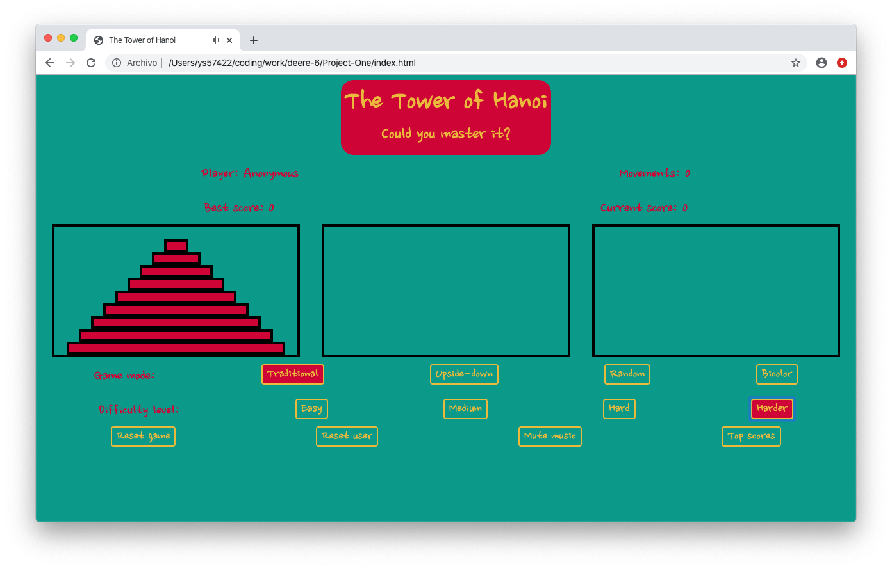

# Project One: Tower of Hanoi

## Basic game

* The original basic game consists of three rods where you can stack discs of different sizes. The clasical game begins with all the discs stacked at the left rod ordered by size.

* Player selects a top disc stacked in a rod.
* Player moves the disc where it wants. But the disc is only moved if these rules are satisfied:
    + You can only move the disc at the top.
    + The disc can only be moved to a rod where the top disc is larger than the one you are moving or it is empty.

* The game continious until all the discs are stacked at the rigth rod.

## Basic logic

* Each disc is represented by an integer number proportional to its size and beggining at zero for the smallest.
* The core of the logic is an array containing 3 sub-arrays.
* Each sub-array contains numbers which represent the discs.
* At the beggining of the game, the initial array is generated by a function.

* A function draws the discs based on the content of the array.
* An event listener is added to the top discs.
* When the player clicks on one of them, a variable stores "from" which rod is going to begin the movement.
* The previous event listeners are removed and new ones are used in the containers of each rod.
* When the player select a container, another variable store "to" where the disc is going to be moved.
* The variables storing "from" and "to" are used to select the top discs. If the "from" disc is smaller than the "to" disc, the movement is considered valid and the array is modified using shift and unshift commands.

* A function checks if all the discs are in the rigth side, if not call the main fuction again and the game continues.

## Page design, styling and additional features

* Main color pallete ("It's raining love") was taken from [Colour lovers website](https://www.colourlovers.com/palette/845564/its_raining_love).

* Music was added to the game section which was obtained from [The free music archive](https://freemusicarchive.org/).

### Landing page

* User Id is required but not compulsory (By default "Anonymous").

### Game page

* Appears after clicking on the play button of the landing page. Music starts to play and loops continously.
* Top information:
    + Player ID
    + Best score (Of the current ID player)
    + Movements of the current game
    + Current score of the game

* Midle section corresponds to the game board

* Bottom selectors:
    + Game mode:
        - Traditional. Normal game.
        - Upside-down. Traditional game but the board and teh discs are upside down.

        - Random. Traditional mode but the game is already started.

        - Bicolor. Variant of the game with the same basic rules. However the game ends when the dics of different color are separated.

    + Difficulty level:
        - Easy: 3 discs for most of the game modes. 2 discs for bicolor mode.
        - Medium: 5 discs for most of the game modes. 3 discs for bicolor mode.
        - Hard: 7 discs for most of the game modes. 4 discs for bicolor mode.
        - Harder: 9 discs for most of the game modes. 5 discs for bicolor mode.
    + Other options:
        - Reset game: restarts the current game.
        - Reset user: reload the page and take you to the landing page.
        - Mute music: set the music volume to 0.
        - Top scores: take you to the scores page.

### Scores page

* Show the best scores in the game.
* Scores are saved using [the webpage local sorage](https://www.w3schools.com/html/html5_webstorage.asp).

